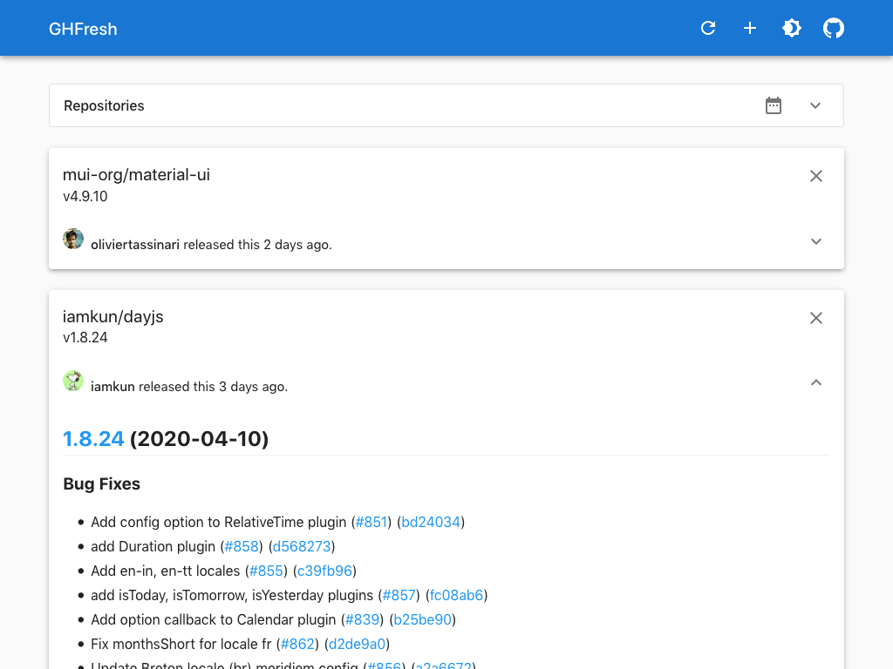

# GHFresh - Monitor GitHub repositories

GHFresh is a SPA to monitor GitHub repositories for new releases.

Visit [https://code2k.github.io/ghfresh/](https://code2k.github.io/ghfresh/) and
give it a try.

<div align="center">


<br>GHFresh light theme

</div>

More [screenshots](https://github.com/code2k/ghfresh/tree/master/screenshots).

## Features

- Add any public repository
- Auto-update
- Markdown rendering of release notes
- Dark mode
- No signup required
- No server. All data is stored in the browsers local storage

## Rate limits

GHFresh is using the public unauthenticated github API. Therefore the number of
requests is pretty limited.

The current rate limits are:

- 60 request per hour for `releases/latest`
- 10 request per minutes for `search/repositories`

If you want to check your current rate limit status:

```sh
curl -s https://api.github.com/rate_limit
```

## Used Libraries

- [preact](https://github.com/preactjs/preact)
- [Material-UI](https://github.com/mui-org/material-ui)
- [Redux Toolkit](https://github.com/reduxjs/redux-toolkit)
- [react-redux](https://github.com/reduxjs/react-redux)
- [Redux Persist](https://github.com/rt2zz/redux-persist)
- [Day.js](https://github.com/iamkun/dayjs)
- [Marked.js](https://github.com/markedjs/marked)

## Development

Clone project:

```sh
git clone https://github.com/code2k/ghfresh.git
```

In the project directory, you can run:

### `yarn start`

Runs the app in the development mode.<br />
Open [http://localhost:3000](http://localhost:3000) to view it in the browser.

The page will reload if you make edits.<br />
You will also see any lint errors in the console.

### `yarn test`

Launches the test runner in the interactive watch mode.<br />
See the section about [running tests](https://facebook.github.io/create-react-app/docs/running-tests) for more information.

### `yarn build`

Builds the app for production to the `build` folder.<br /> It correctly bundles
the application in production mode and optimizes the build for the best
performance.

### `yarn report`

Generates a report of the bundled packages using [webpack-bundle-analyzer](https://github.com/webpack-contrib/webpack-bundle-analyzer).

## Licence

```
MIT License

Copyright (c) 2020 CODE2K:LABS

Permission is hereby granted, free of charge, to any person obtaining a copy of
this software and associated documentation files (the "Software"), to deal in
the Software without restriction, including without limitation the rights to
use, copy, modify, merge, publish, distribute, sublicense, and/or sell copies
of the Software, and to permit persons to whom the Software is furnished to do
so, subject to the following conditions:

The above copyright notice and this permission notice shall be included in all
copies or substantial portions of the Software.

THE SOFTWARE IS PROVIDED "AS IS", WITHOUT WARRANTY OF ANY KIND, EXPRESS OR
IMPLIED, INCLUDING BUT NOT LIMITED TO THE WARRANTIES OF MERCHANTABILITY,
FITNESS FOR A PARTICULAR PURPOSE AND NONINFRINGEMENT. IN NO EVENT SHALL THE
AUTHORS OR COPYRIGHT HOLDERS BE LIABLE FOR ANY CLAIM, DAMAGES OR OTHER
LIABILITY, WHETHER IN AN ACTION OF CONTRACT, TORT OR OTHERWISE, ARISING FROM,
OUT OF OR IN CONNECTION WITH THE SOFTWARE OR THE USE OR OTHER DEALINGS IN THE
SOFTWARE.
```
